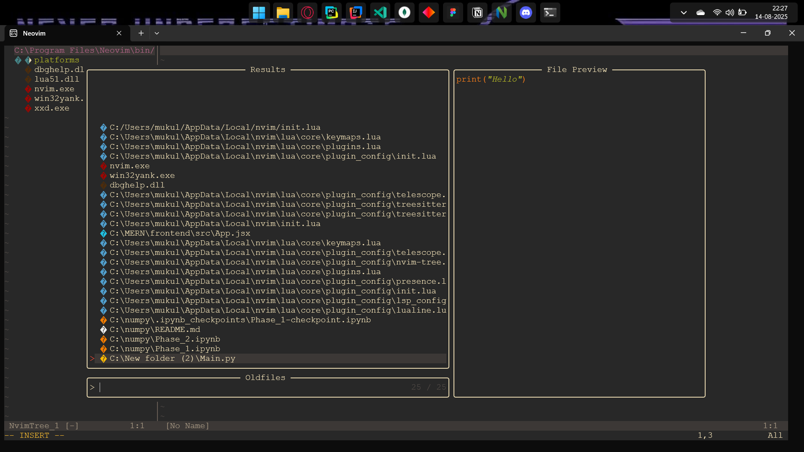

# Neovim Config 4 Everyone

This is my personal **Neovim configuration** — designed to be easy to set up, beginner-friendly, and ready for coding in multiple languages.

---

## 📸 Preview


---

## 🚀 Features
- **Pre-installed Plugins** for productivity and coding
- **LSP Support** for modern languages
- **Treesitter** syntax highlighting
- **Auto-completion** via nvim-cmp
- **File Explorer** with nvim-tree
- **Statusline** with lualine
- **Git Integration**
- **Python / Jupyter / Magma** support

---

## 📥 Installation

### 1️⃣ Backup your current config (optional)
```powershell
mv $env:LOCALAPPDATA\nvim $env:LOCALAPPDATA\nvim_backup
